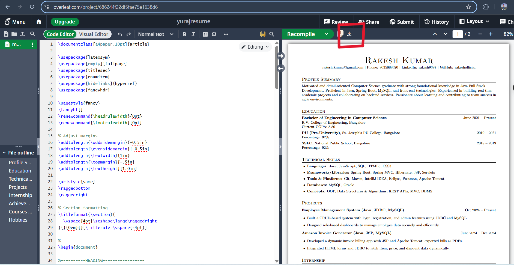
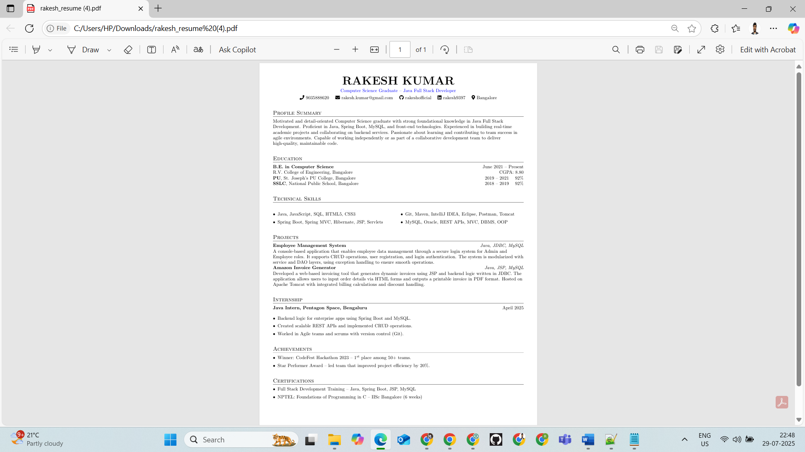

<h1 align="center">📄 Overleaf Resume Template Guide</h1>

<p align="center"><em>✨ Create a Professional Resume with LaTeX & Overleaf</em></p>

---

## 📂 Repository Contents

- [`over leaf resume template code.txt`](OverLeaf_Resume_Template_Code.txt) – LaTeX source code for a polished resume  
- [`rakesh_resume.pdf`](rakesh_resume.pdf) – Example PDF output  
- `images/` – Screenshots for visual guidance  

---

## 🎯 Why Use This Template?

✅ Clean & Professional Design  
✅ No LaTeX Experience Needed  
✅ Customizable via ChatGPT  
✅ Perfect for Tech/Academic Roles  

---

# 🚀 Step-by-Step Guide

## 1️⃣ Set Up Overleaf
🔹 Visit: [https://www.overleaf.com](https://www.overleaf.com)  
🔹 Sign Up or Login using your Email or Google account  

<p align="center">
  
</p>

---

## 2️⃣ Create a New Project
- Click `New Project` → `Blank Project`  
- Give it a name like `My_Professional_Resume`  

<p align="center">
  
</p>

---

## 3️⃣ Paste the Template Code
1. Open [`over leaf resume template code.txt`](OverLeaf_Resume_Template_Code.txt)  
2. Copy **all LaTeX code**  
3. Paste into the **left panel** of the Overleaf editor  
4. Press **Ctrl + S** or click **Recompile**  

<p align="center">
  
</p>

---

## 4️⃣ Customize Your Resume

### 🖋️ Manual Editing
Update fields like:
```latex
\name{Your Name}
\email{your.email@example.com}
\education{Your Degree}

```

### 🤖 **AI-Assisted (ChatGPT)**  
1. Paste template into [ChatGPT](https://chat.openai.com)  
2. Prompt:  
   > "Update this LaTeX resume with:  
   > - Name: [Your Name]  
   > - Education: [Your Degree]  
   > - Skills: [Python, SQL, ...]"  

---

## 5️⃣ **Download PDF**
✅ Click **Download PDF** (top-right)  



---

# 🎨 Sample Output
📎 Click to View rakesh_resume.pdf
(Open the PDF directly in your browser or download it)

<p align="center">  </p>

---
# ❓ Need Help?
- **Overleaf Docs**: [https://www.overleaf.com/learn](https://www.overleaf.com/learn)  
- **Contact Me**: [rkkumbar97@gmail.com](mailto:rkkumbar97@gmail.com)  


<p align="center"><strong>✨ Happy Resume Building & Best of Luck! ✨</strong></p>

<p align="center"><em>Crafted with care by <a href="https://ravikumarxworkz.github.io/" target="_blank">Ravikumar Shankar Kumbar</a></em></p>

