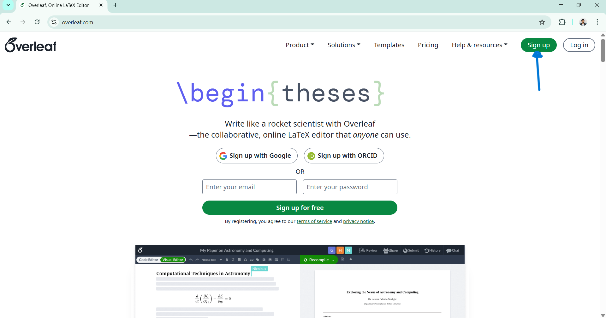
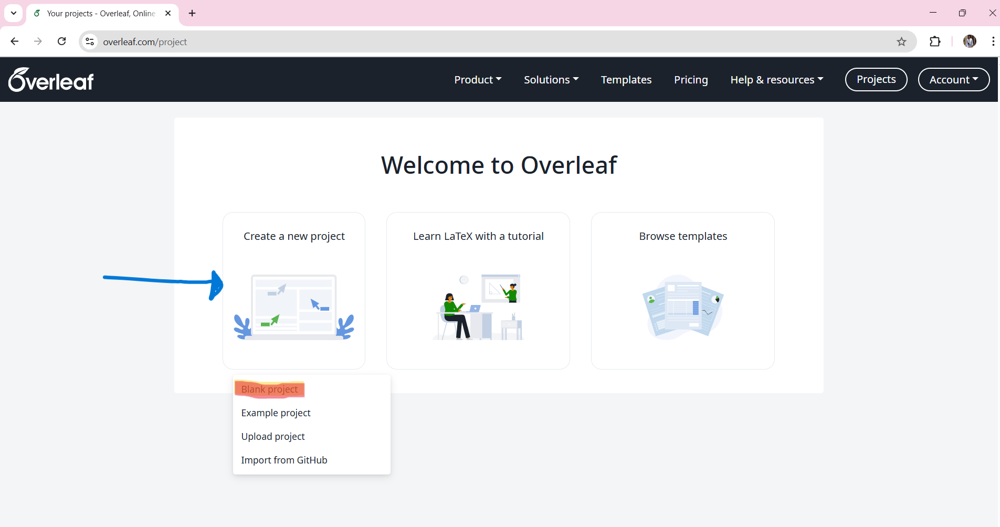
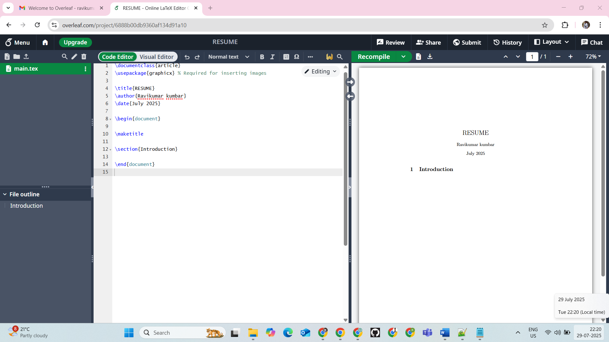

## 📄 Overleaf Resume Template Guide

✨ **Create a Professional Resume with LaTeX & Overleaf**  

---

## 📂 Repository Contents

- `overleaf-resume-code.txt` - LaTeX source code for a polished resume template  
- `rakesh_resume.pdf` - Example PDF output  
- `images/` - Screenshots for visual guidance  

---

## 🎯 Why Use This Template?

✅ **Clean & Professional Design**  
✅ **No LaTeX Experience Needed**  
✅ **Customizable via ChatGPT**  
✅ **Perfect for Tech/Academic Roles**  

---

# 🚀 Step-by-Step Guide

## 1️⃣ **Set Up Overleaf**
🔹 **Visit**: [https://www.overleaf.com](https://www.overleaf.com)  
🔹 **Sign Up/Login** (Google/Email)  



---

## 2️⃣ **Create Project**
- Click `New Project` → `Blank Project`  
- Name it (e.g., `My_Professional_Resume`)  



---

## 3️⃣ **Paste Template Code**
1. Open `overleaf-resume-code.txt`  
2. **Copy ALL LaTeX code**  
3. Paste into Overleaf’s editor (left panel)  
4. Click **Recompile**  



---

## 4️⃣ **Customize Your Resume**
### 🖋️ **Manual Editing**  
Edit directly in Overleaf (update sections like):  
```latex
\name{Your Name}
\email{your.email@example.com}
```

### 🤖 **AI-Assisted (ChatGPT)**  
1. Paste template into [ChatGPT](https://chat.openai.com)  
2. Prompt:  
   > "Update this LaTeX resume with:  
   > - Name: [Your Name]  
   > - Education: [Your Degree]  
   > - Skills: [Python, SQL, ...]"  


---

## 5️⃣ **Download PDF**
✅ Click **Download PDF** (top-right)  


---

# 🎨 Sample Output
 *(Click to view)*

---
# ❓ Need Help?
- **Overleaf Docs**: [https://www.overleaf.com/learn](https://www.overleaf.com/learn)  
- **Contact Me**: [your.email@example.com](mailto:your.email@example.com)  


🌟 **Happy Resume Building!**  
*Crafted with care by [RAVIKUMAR SHANKAR KUMBAR]*
